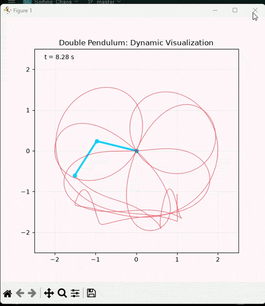
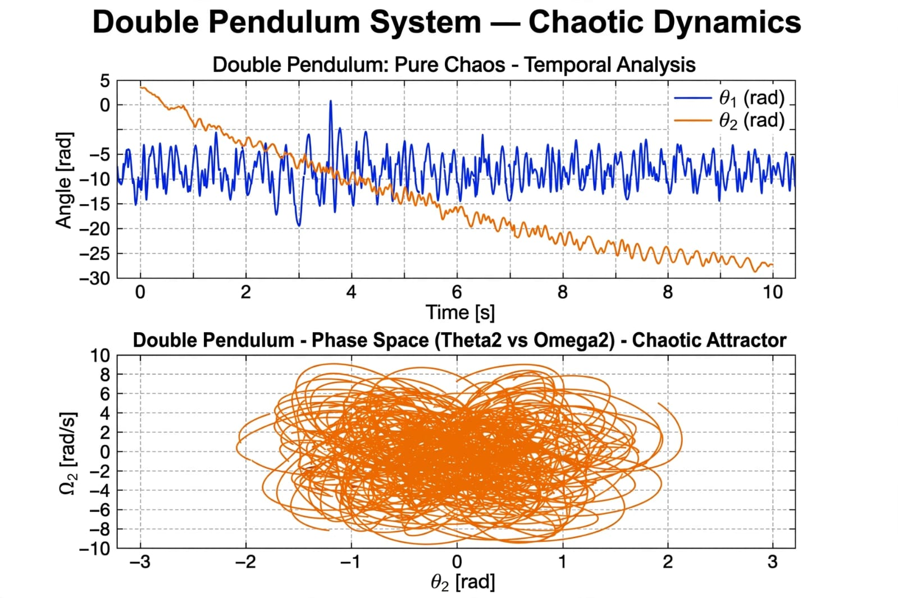

# Simulation of a Chaotic Double Pendulum in Python



Numerical solution of the system of four coupled nonlinear ODEs describing the motion of a double pendulum. A personal project developed to understand numerical integration, chaotic systems, and sensitivity to initial conditions.

## Result

### Dynamic Visualization
The animation above shows the chaotic trajectory. Small differences in initial conditions generate completely divergent paths - the hallmark of chaos.

### Temporal Analysis

*The graph shows: Trajectories in phase space and time evolution. The chaotic nature of the system is evident: small differences in initial conditions generate divergent trajectories.*

## 🧠 Learning Methodology
This project was developed using the **"Parametric Experimentation Method"**:
1.  **Transcription of the base model:** The differential equations of the double pendulum were used as a starting point.
2.  **Intentional modification:** Masses, lengths, and initial conditions were varied to observe the system's response.
3.  **Results Analysis:** Chaotic behaviors and numerical stability limits were identified.

Each commit reflects an experimental change to understand the underlying physics.

## 🛠 Technical Stack
*   **Language:** Python 3.10+
*   **Libraries:** NumPy, SciPy (`solve_ivp`), Matplotlib
*   **Integrator:** `RK45` with adaptive tolerance, ideal for non-stiff chaotic systems.

## 🚀 How to Run It
```bash
# Clone the repository
git clone https://github.com/Jorge5656a08B/double-pendulum-chaos-simulation.git

# Install dependencies
pip install -r requirements.txt

# Run simulation
python main.py