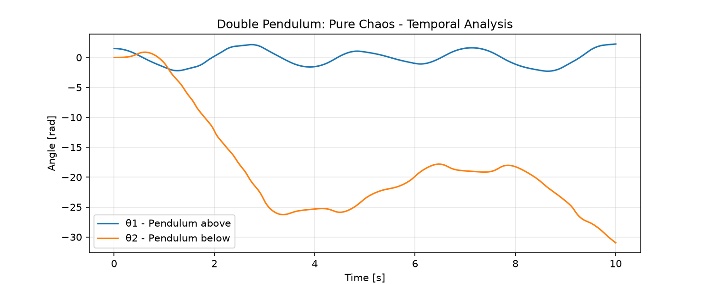

# Simulation of a Chaotic Double Pendulum in Python

Numerical solution of the system of four coupled nonlinear ODEs describing the motion of a double pendulum. A personal project developed to understand numerical integration, chaotic systems, and sensitivity to initial conditions.

## 📊 Result

*The graph shows:* Trajectories in phase space and time evolution. The chaotic nature of the system is evident: small differences in initial conditions generate divergent trajectories.

## 🔬 Learning Methodology

This project was developed using the *"Parametric Experimentation Method"*:
1. *Transcription of the base model:* The differential equations of the double pendulum were used as a starting point.

2. *Intentional modification:* Masses, lengths, and initial conditions were varied to observe the system's response.

3. *Results Analysis:* Chaotic behaviors and numerical stability limits were identified.

Each commit reflects an experimental change to understand the underlying physics.

## ⚙️ Technical Stack

- *Language:* Python 3.10+
- *Libraries:* NumPy, SciPy (solve_ivp), Matplotlib
- *Integrator Used:* RK45 with adaptive tolerance
- *Simulation Time:* 20s with an evaluation step of 0.02s

## 🚀 How to Run It

git clone https://github.com/your-username/double-pendulum-chaos-simulation.git
cd double-pendulum-chaos-simulation
pip install numpy scipy matplotlib
python double_pendulum.py

The script generates the `pendulum_analysis.png` graph and displays the animation.

💡 Key Learnings

- High sensitivity to initial conditions is the hallmark of chaotic systems.

- SciPy's `RK45` method is robust for non-rigid ODEs, but requires adjustment of `rtol` and `atol` in sensitive systems.

- Visualizing phase space is crucial for interpreting nonlinear dynamics.

🎯 Next Step

Extend the model to include friction at the pivots and force the system to study parametric resonance.

👤 Author

Jorge Espino Garza
Mechatronics Engineer | Scientific Simulation with Python
Transitioning to R&D in Nonlinear Dynamics and Aerospace

www.linkedin.com/in/jorge-espino-garza

---
_Project developed as part of my self-taught specialization in applied numerical methods._

---